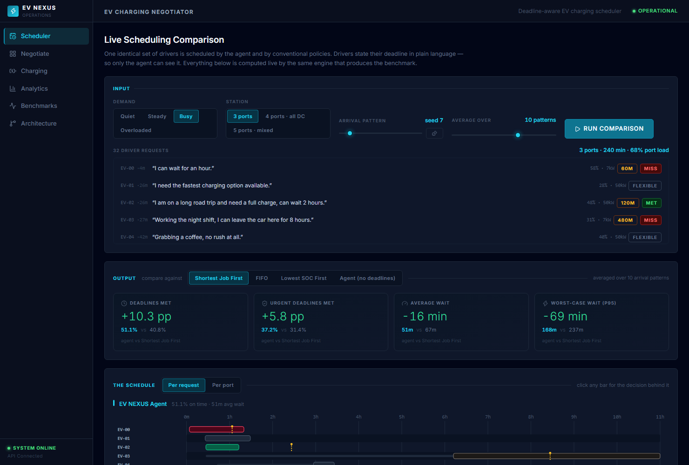
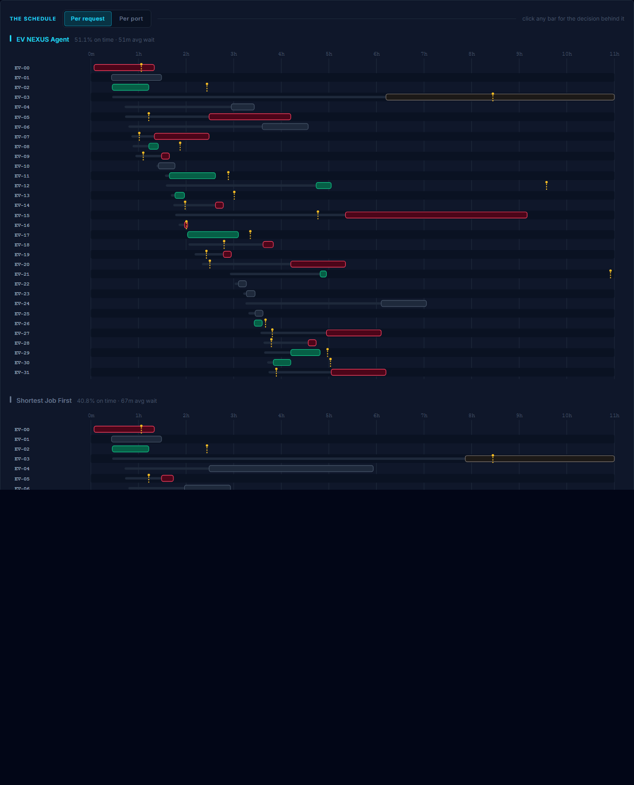
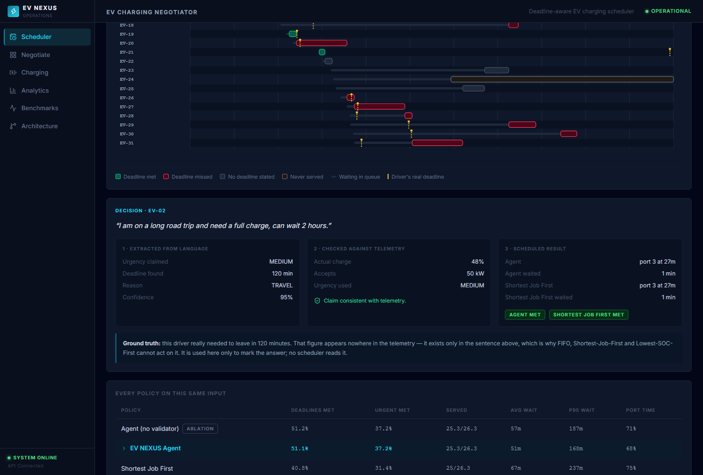
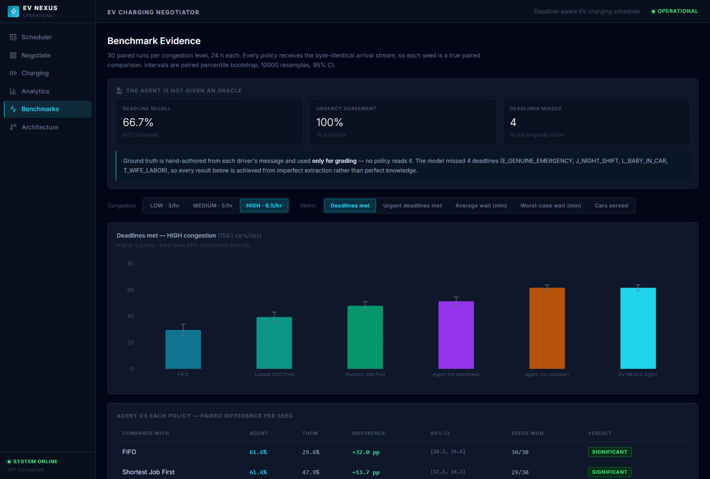

# EV NEXUS

### LLM-Assisted EV Charging Negotiation & Resource-Aware Scheduling

**Live Demo:** [ev-nexus.pages.dev](https://ev-nexus.pages.dev)
**Backend API:** [ev-nexus-backend.onrender.com](https://ev-nexus-backend.onrender.com) · [health check](https://ev-nexus-backend.onrender.com/api/health)
**GitHub:** [github.com/Karthik705/ev-nexus](https://github.com/Karthik705/ev-nexus)
**Architecture:** [docs/ARCHITECTURE.md](docs/ARCHITECTURE.md)

> The backend runs on Render's free tier, which spins down after 15 minutes of inactivity — the first request after a period of idleness can take 30–60 seconds to wake it up. This is a known, documented free-tier trade-off (see [docs/DEPLOYMENT.md](docs/DEPLOYMENT.md)), not a bug.
>
> Gemini live status: `GEMINI_API_KEY` is configured on the deployed backend, and a live smoke test confirmed the key authenticates correctly with Google's API — but that test hit a transient `503 Service Unavailable` from the Gemini model itself, so live structured-intent extraction succeeding end-to-end has **not yet been confirmed**. The system correctly fell back to deterministic telemetry both times, which every negotiation still uses reliably right now. See `docs/DEPLOYMENT.md` for the full test detail.

An EV charging station scheduler that reads what drivers actually say, recovers the
constraint hiding in the sentence, checks it against telemetry so nobody can lie their
way to the front, and schedules the station around it.

### The idea in one line

A driver who says *"my flight leaves in 2 hours and the airport is 40 minutes away"*
has an **80-minute deadline**. That number exists nowhere in the telemetry — not in
state of charge, not in battery size, not in arrival time. A conventional scheduler
(FIFO, Shortest-Job-First, Lowest-SOC-first) cannot act on it at any price, because it
never sees it. This project recovers it from language and schedules against it.

### Headline result

30 paired runs per congestion level. Every policy gets the byte-identical arrival
stream, identical physics, identical pricing, identical budget rules. Deadline
adherence, high congestion (6.5 cars/hr):

| Policy | Deadlines met | Urgent met | Avg wait | p95 wait | Served |
|---|---|---|---|---|---|
| FIFO | 29.6% | 17.6% | 164 min | 407 min | 96.8% |
| Lowest-SOC-first | 39.4% | 33.2% | 148 min | 763 min | 97.3% |
| Shortest-Job-First | 47.9% | 38.1% | 83 min | 493 min | 97.8% |
| **EV NEXUS agent** | **61.6%** | **48.6%** | **53 min** | **226 min** | **98.5%** |

**+32.0 pp over FIFO** (won 30/30 seeds) · **+13.7 pp over Shortest-Job-First**
(29/30) · **+22.2 pp over Lowest-SOC-first** (30/30). All intervals exclude zero.
The agent also serves *more* cars using *less* port time — this is not a fairness-vs-
throughput trade.

### Why it is not just a better-tuned scheduler

The control is an ablation: the identical scheduler with the language-derived deadline
withheld. It collapses to **51.2%** — roughly back to the conventional policies. The
gain is the information, not the tuning. And the agent works from *imperfect*
extraction: Gemini recovered only **8 of 12** ground-truth deadlines (66.7% recall).

| | |
|---|---|
| **LLM** | Gemini extracts the deadline and urgency hiding in the sentence — it interprets, it never decides. |
| **Safety** | A deterministic validator cross-checks every claim against telemetry. "This is an emergency" from an 85%-full battery gets downgraded, not obeyed. |
| **Scheduling** | A deterministic deadline-feasibility matcher makes every dispatch decision. Not the LLM, not DQN. |
| **Honesty** | Ground-truth deadlines are hand-authored and used **only for grading**. A test perturbs them and asserts the agent's behaviour does not change. |
| **Fallback** | Gemini unavailable, rate-limited or returning malformed JSON degrades to telemetry-only scheduling, tested. |



## Table of Contents

- [Problem Statement](#problem-statement)
- [Key Features](#key-features)
- [Architecture](#architecture)
- [Technology Stack](#technology-stack)
- [How the LLM Is Used](#how-the-llm-is-used)
- [Safety / Validation Architecture](#safety--validation-architecture)
- [Scheduling Algorithms](#scheduling-algorithms)
- [DQN Experimental Findings](#dqn-experimental-findings)
- [Benchmark Methodology](#benchmark-methodology)
- [Important Results](#important-results)
- [Limitations](#limitations)
- [Screenshots](#screenshots)
- [Local Setup](#local-setup)
- [Environment Variables](#environment-variables)
- [API Endpoints](#api-endpoints)
- [Testing](#testing)
- [Deployment](#deployment)
- [Project Structure](#project-structure)
- [Future Improvements](#future-improvements)

---

## Problem Statement

EV charging stations must balance:

- driver urgency (stated in natural language)
- charging deadlines
- battery state (SOC telemetry)
- charging-port compatibility
- station congestion
- driver budgets

Traditional scheduling algorithms cannot interpret natural-language driver requirements. A driver saying "my wife is in labor" carries more scheduling weight than a driver saying "I'm not in a rush" — but only an NL-aware system can distinguish them. At the same time, a system that blindly trusts what a driver *claims* is unsafe: it can be gamed. EV NEXUS's core design bet is that an LLM should **interpret** language, while a deterministic layer **enforces** physical truth.

## Key Features

- Natural-language driver request → structured intent (Gemini 2.5 Flash / `gemini-flash-latest`)
- Deterministic "lie detector": downgrades urgency claims that contradict telemetry (e.g. claiming `CRITICAL` at 85% SOC)
- Automatic, transparent fallback to telemetry-only priority when Gemini is unavailable, rate-limited, or returns malformed output
- Resource-aware port assignment (7 kW / 50 kW / 150 kW ports, matched to vehicle charging capability)
- Budget-aware dispatch — a request whose estimated cost exceeds its budget is honestly reported as **rejected**, not silently queued (see [Limitations](#limitations) for the bug this replaced)
- Six-policy benchmark suite (FIFO, PRIORITY, SJF, TELEMETRY_ONLY, LLM_NEGOTIATOR, DQN) over reproducible fixture-based scenarios
- React dashboard: Overview (interactive negotiation), Charging (live session monitor), Analytics, Benchmarks, Architecture
- Live backend health check surfaced in the UI (not a static "always online" badge)
- Per-session simulation state so concurrent demo users don't corrupt each other's runs

## Architecture

```
Driver NL message
       ↓
  Gemini 2.5 Flash                 (llm_negotiator.py)
  (structured intent extraction)
       ↓
  Deterministic Validator          (constraint_validator.py)
  (SOC contradiction check, budget/port feasibility)
       ↓
  Resource-Aware Priority Scheduler (simple_ev_simulation.py)
  (urgency × wait × deadline pressure)
       ↓
  Charging Station Port Assignment
```

Full component-level data flow, file paths, and the FastAPI route map are in **[docs/ARCHITECTURE.md](docs/ARCHITECTURE.md)**.

### Safety Invariant

The LLM **interprets** intent; it cannot override physical constraints. The deterministic validation layer always enforces:
- Actual SOC (from telemetry, not self-report)
- Maximum charging speed
- Budget cap
- Port availability

If a driver claims `CRITICAL` urgency but has 85% SOC, the validator downgrades them to `LOW` priority and flags the contradiction. This is directly testable: `tests/test_core.py::test_lie_detector_contradiction_triggered`.

## Technology Stack

| Layer | Technology |
|---|---|
| Backend | Python 3.11, FastAPI, Pydantic, Uvicorn |
| LLM | Google Gemini (`google-genai` SDK, `gemini-flash-latest`) |
| Simulation / RL | NumPy, PyTorch, Gymnasium (DQN experimental baseline) |
| Frontend | React 19, TypeScript, Vite 8, React Router, Recharts, Tailwind |
| Testing | pytest (backend), `tsc` + Vite build (frontend type/build check) |

## How the LLM Is Used

`llm_negotiator.py`'s `GeminiNegotiator.negotiate()` sends the raw driver message to Gemini with a prompt that requests strict JSON: `urgency_level`, `deadline_minutes`, `reason_category`, `claimed_constraints`, `requested_port_type`, `confidence`, `explanation`. The call runs at `temperature=0.0`. Failures are classified (`AUTH_ERROR`, `MODEL_NOT_FOUND`, `RATE_LIMIT`, `PARSE_ERROR`, `TIMEOUT`, `UNKNOWN_ERROR`) rather than swallowed silently, and every classification is logged in `negotiator.error_log`.

**The application has deterministic fallback behavior whenever Gemini is unavailable.** If the call fails for any reason, or `force_fallback` is requested, the system falls back to computing urgency purely from telemetry (SOC tiers: <20% → `TELEMETRY_CRITICAL`, <50% → `TELEMETRY_MEDIUM`, else `TELEMETRY_LOW`). This is exercised by `tests/test_core.py::test_negotiate_no_client_returns_fallback` and is toggleable live in the UI via the "Force fallback" checkbox on the Overview page.

## Safety / Validation Architecture

`constraint_validator.py`'s `ConstraintValidator.validate_request()` is the single point where LLM output meets telemetry:

- `actual_soc`, `battery_capacity`, `max_charging_speed`, `budget` are always taken from the caller-supplied telemetry arguments — **never** from the LLM's parsed output. The LLM cannot set or override any of these fields.
- The LLM's `urgency_level` is mapped to a numeric score, then the **lie detector** fires: if the claimed urgency score is above 0.5 *and* actual SOC is above 60%, the score is forced down to 0.2 and `contradiction_found=True` is set.
- Feasible ports are computed from the actual (not claimed) port occupancy state.

This means a driver cannot talk their way into skipping the queue with a fabricated emergency if their battery telemetry contradicts the claim — verified in `tests/test_core.py` with boundary tests at exactly 60% and 61% SOC.

## Scheduling Algorithms

Policies compared in the current (v2) benchmark. Every one shares identical physics,
pricing and budget rules; only the decision differs.

| Policy | Sees language? | Decision rule |
|---|---|---|
| **FIFO** | no | Arrival order. The fairness baseline. |
| **Shortest-Job-First** | no | Least energy first. The throughput-optimal conventional baseline. |
| **Lowest-SOC-first** | no | Emptiest battery first. The strongest telemetry-only baseline. |
| **EV NEXUS agent** | **yes** | Deadline-feasibility matching (below). |
| *Agent (no validator)* | yes | Ablation: trusts the urgency claim outright. |
| *Agent (no deadlines)* | partly | Ablation: language-derived deadline withheld. **The control.** |

All three conventional baselines are given the same best-fit port heuristic, so they
are competitive rather than strawmen — the only thing that differs is queue ordering.

### How the agent actually schedules

Each minute, it scores every feasible (car, port) pair and greedily commits the best
non-conflicting ones — a greedy maximum-weight matching. The score has five terms:

1. **Deadline feasibility (dominant).** If finishing on this port lands before the
   driver's deadline, the pairing gets a large bonus. Saving a deadline outranks
   everything else.
2. **Least slack first.** Among assignments that work, commit the tightest. A driver
   with four hours of slack loses nothing by waiting ten minutes.
3. **Validated urgency.** Telemetry-checked, never the raw claim.
4. **Power matching.** Reward power actually delivered; penalise parking a 7 kW car on
   a 150 kW port. This is what keeps throughput competitive instead of trading it away.
5. **Aging.** Nobody starves.

When Gemini returns no deadline — which happens for *"my wife is in labor"*, since
there is no number in the sentence — the agent infers one from validated urgency
(CRITICAL → 15 min). Without that rule those cases would be treated as having
unlimited slack.

## DQN Experimental Findings

DQN was investigated extensively but exhibited reward hacking and value-hoarding behaviour in the discrete-time formulation: the agent learned to defer dispatching indefinitely to avoid negative rewards rather than optimising utilisation. It consistently produced the lowest satisfaction scores across all scenarios (0.09–0.13 vs 0.31–0.61 for heuristics). **DQN is retained as an experimental baseline only — it is not claimed to be competitive with the deterministic schedulers.**

The checkpoint behind the DQN numbers reported below is `ev_dqn_model_v5.pth` (42-dim state, 26-dim action, matching the current `ev_gym_env.py`). Four earlier checkpoints (`ev_dqn_model.pth`, `_v2`, `_v3`, `_v4`) exist on disk from earlier iterations of the environment (some with a 20-dim, some a 25-dim observation space, incompatible with the current architecture) and are kept for historical reference only — they are **not** used in any current result. Full checkpoint-by-checkpoint provenance, including what loads, what doesn't, and what evidence exists for each, is documented in **[docs/DQN_PROVENANCE.md](docs/DQN_PROVENANCE.md)**.

## Benchmark Methodology

The benchmark grades **deadline adherence**: did the car get the energy it needed
before the driver had to leave? That is the question language unlocks and telemetry
cannot answer.

**Ground truth is hand-authored.** For each of the 20 canonical driver messages,
`scenario_library.py` records the deadline a careful human reader would infer from the
sentence, with the reasoning written down next to it. These labels are the answer key:

- they are authored **independently of what Gemini extracted**, so extraction quality
  is itself measurable rather than assumed, and
- they are used **only for grading**. A test
  (`test_agent_beliefs_are_causally_independent_of_ground_truth`) perturbs every
  ground-truth deadline by +997 minutes and asserts the agent's decisions are byte-
  identical. If the answer key ever leaks into the decision path, that test fails.

**The agent works from imperfect inputs.** Gemini recovered 8 of 12 ground-truth
deadlines (66.7% recall), missing the ones with no number in the sentence —
*"leave immediately"*, *"ASAP"*, *"right now"*, *"8 hours"*. Urgency agreement was
100%. A further test asserts extraction is *not* perfect, to guard against someone
silently substituting an oracle.

**Pairing.** One arrival stream is generated per seed and replayed verbatim to every
policy (common random numbers), so each seed is a genuine paired observation.
Confidence intervals are paired percentile bootstrap, 10 000 resamples.

Reproduce with `python benchmark_v2.py` — no API key, no network (it replays the
captured Gemini outputs in `llm_fixtures.json`). Full methodology:
**[docs/EXPERIMENTS.md](docs/EXPERIMENTS.md)**.

## Important Results

### Deadline adherence, by congestion (30 paired seeds each)

| | LOW (3/hr) | MEDIUM (5/hr) | HIGH (6.5/hr) |
|---|---|---|---|
| FIFO | 74.5% | 51.4% | 29.6% |
| Lowest-SOC-first | 75.0% | 56.9% | 39.4% |
| Shortest-Job-First | 74.7% | 59.7% | 47.9% |
| **EV NEXUS agent** | **76.7%** | **65.7%** | **61.6%** |
| *ablation: no deadlines* | *76.0%* | *61.4%* | *51.2%* |

Paired improvement over the **best** conventional baseline at each level:
**+1.8 pp** (LOW) → **+5.9 pp** (MEDIUM) → **+13.7 pp** (HIGH). Every interval
excludes zero.

The gap widens with congestion, which is the intuitive result: when the station has
spare capacity everyone is served promptly and scheduling barely matters. Knowing who
is actually in a hurry only pays once there is contention. At LOW load the agent's
advantage is small — reported rather than hidden.

### It does not buy deadlines with throughput

At HIGH congestion the agent serves **98.5%** of arrivals (vs 96.8–97.8%) while using
**76.0%** of available port time (vs 82.4–83.7%). More cars served, less port time
consumed, shorter waits, better deadline adherence — simultaneously. The power-matching
and short-job terms are what prevent the usual fairness-for-throughput trade.

### What the validator is actually worth

Honest answer: **nothing when nobody games the system**, and that is correct behaviour
for an integrity mechanism. Its value appears only under adversarial pressure:

| Drivers faking urgency | With validator | Without | Paired difference |
|---|---|---|---|
| 0% | 58.0% | 57.1% | +0.9 pp (not significant) |
| 20% | 57.4% | 54.5% | +2.9 pp |
| 50% | 56.2% | 49.9% | **+6.3 pp** |

So the claim is *not* "validation improves throughput" — measured, it does not. The
claim is that it stops a driver from talking their way to the front of the queue, and
that this matters more the more people try it.

### Superseded: the earlier Phase 5 benchmark

`phase5_results.json` is retained for provenance but its comparison was **not sound**,
and its numbers are deliberately not restated here. Three defects:

1. **Budget parity.** The budget constraint was enforced only for the agent policies;
   FIFO/SJF/PRIORITY ignored it entirely, so the agent was the only policy that ever
   turned a customer away.
2. **Broken pairing.** Runs were seeded, but the agent policies then consumed extra
   random draws, so arrival streams silently diverged between policies.
3. **Wrong metric.** It never measured deadline adherence — the one thing language
   provides — so the agent's actual advantage was invisible and the comparison rested
   on a satisfaction score averaged over completed cars only, which flatters a policy
   that serves few cars quickly.

These were found by auditing the old harness, are documented in
[docs/EXPERIMENTS.md](docs/EXPERIMENTS.md), and are the reason the v2 benchmark exists.

## Limitations

- **Gemini live calls are not verified as part of this repository's automated testing.** All backend tests and API smoke tests use `force_fallback=True` or cached fixtures, deliberately, to avoid unpredictable API cost/availability during development and CI. The deterministic fallback path is fully tested; the live Gemini call path has only ever been exercised by hand. Do not assume Gemini is always available — the system is designed to degrade gracefully when it isn't.
- **The benchmark replays captured Gemini output rather than calling the API per car.** This is deliberate: a 30-seed × 3-congestion × 6-policy sweep would be thousands of live calls, and API latency/quota variance would contaminate a scheduling comparison. The replayed outputs are real captured responses (`llm_fixtures.json`), including their mistakes.
- **`app.py` uses per-session, in-process state** (keyed by `session_id`), sufficient for a local demo but not production: state is lost on restart and not shared across replicas, and there is no session TTL/cleanup.
- **Fixed bug (this pass):** the target charge level was previously a hardcoded 80 kWh (not 80%), so any vehicle with a battery smaller than 80 kWh would show an SOC reading above 100% while charging. Fixed to be 80% of that vehicle's own capacity in both the interactive `/api/negotiate` path and the simulator's random-EV generator. See `docs/TEST_REPORT.md`.
- **Fixed bug (this pass):** an over-budget request was previously silently dropped by the scheduler but reported to the frontend as `"WAITING"` (indistinguishable from a genuinely queued request). The API now reports `"REJECTED_BUDGET"` and the UI shows an explicit rejection state. See `docs/TEST_REPORT.md`.
- No persistent time-series analytics — the Analytics page is explicit about this in its own UI copy.
- CORS defaults to `http://localhost:5173` for local development; **must** be set explicitly via `ALLOWED_ORIGINS` for any deployment.
- Frontend bundle is a single ~710 KB chunk (Vite warns above 500 KB) — not code-split. Cosmetic, not a functional issue.
- **The simulation is a simulation.** Arrival times, battery sizes and accepted charge rates are drawn from plausible distributions, not from real station data. The physics (power limits, taper above 80% SOC) are simplified. The *comparison* between policies is sound because every policy faces the identical world; the absolute percentages are not a claim about any real forecourt.
- **The 20 driver messages are a fixed set.** Results depend on that scenario mix. A station whose customers never state deadlines would see no benefit from this approach — which is exactly what the LOW-congestion and no-deadline-ablation rows show.
- **Ground-truth deadline labels are a judgement call.** "Leave immediately" is encoded as 10 minutes; a different reader might say 5 or 15. The reasoning for every label is recorded in `scenario_library.py` so the choices can be argued with.

## Screenshots

**Live scheduling comparison** — clear input (the actual driver requests), visible
scheduling (both policies on one time axis), explicit output (paired deltas):


**The schedule itself** — agent above, baseline below, same arrivals, same axis. Green
met the driver's deadline, red missed it, the yellow tick is the deadline, the thin
grey bar is time spent waiting in the queue:



**Why a car was scheduled where it was** — language → telemetry check → outcome, with
the same car's fate under the baseline for contrast:



**Benchmark evidence** — paired confidence intervals, per-seed win counts, and the
agent's own input quality stated up front:



## Local Setup

### Backend Setup

```bash
pip install -r requirements.txt
cp .env.example .env        # optional — without a key it runs on telemetry fallback
uvicorn app:app --reload
```

Reproduce the benchmark (no API key or network needed):

```bash
python benchmark_v2.py          # 30 paired seeds x 3 congestion levels
python scenario_library.py      # extraction quality vs ground truth
python schedule_engine.py       # one stream through every policy
```

### Frontend Setup

```bash
cd frontend
npm install
cp .env.example .env        # optional — only needed to override the backend URL
npm run dev
```

Frontend defaults to `http://127.0.0.1:8000/api` if `VITE_API_BASE` is unset — no `.env` is required for local development against a backend on the default port.

## Environment Variables

| Variable | Where | Purpose | Default |
|---|---|---|---|
| `GEMINI_API_KEY` | backend `.env` | Gemini API key. If unset or invalid, the app deterministically falls back to telemetry-only priority — it does not crash. | none (fallback used) |
| `ALLOWED_ORIGINS` | backend env | Comma-separated CORS allowlist. | `http://localhost:5173,http://127.0.0.1:5173` |
| `VITE_API_BASE` | frontend `.env` (build-time) | Backend API base URL, e.g. `https://your-backend.example.com/api`. | `http://127.0.0.1:8000/api` |

Never commit a real `.env` file — `.env.example` files (root and `frontend/`) contain only safe placeholders and are the ones meant to be tracked in version control.

## API Endpoints

| Method | Path | Purpose |
|---|---|---|
| `GET` | `/api/health` | Liveness probe — used by the frontend's connection indicator and suitable for deployment platform health checks. |
| `POST` | `/api/negotiate` | Full pipeline: LLM (or fallback) → validation → scheduling → dispatch for one driver request. |
| `GET` | `/api/station` | Current port/queue/metrics state for a session. |
| `POST` | `/api/step` | Advance the simulation clock without adding new EVs. |
| `POST` | `/api/reset` | Reset a session's simulation to a clean state. |
| `POST` | `/api/new-session` | Allocate a new isolated `session_id`. |
| `GET` | `/api/scenarios` | The 20 canonical driver messages, what Gemini extracted from each, and extraction quality vs ground truth. |
| `POST` | `/api/compare` | **Schedules one identical set of arrivals under every policy** and returns full timelines plus metrics. Backs the live comparison page. Optional `repeats` averages over N arrival patterns. |
| `GET` | `/api/benchmarks` | Serves an allowlist of result files, including `benchmark_v2_results.json`. |

## Testing

```bash
# Backend: engine, fairness invariants, validator, regression guards
pytest tests/ -v                       # 32 tests

# Frontend type check + production build
cd frontend && npm run build

# Browser end-to-end (needs a backend running; see note below)
cd frontend && npm run test:e2e        # 9 tests
```

**32 Python tests.** Beyond functionality these lock in the *fairness* invariants, so
the class of bug that invalidated the v1 benchmark cannot return silently:

- the budget rule is identical across policies,
- pricing has no urgency component (the agent cannot inflate revenue by knowing urgency),
- conventional policies hold no deadline belief at all,
- the arrival stream is not mutated or regenerated per policy,
- ground truth is causally independent of agent decisions,
- extraction is imperfect (guards against swapping in an oracle),
- no port is ever double-booked,
- and the headline claims themselves are regression tests.

**9 Playwright tests** run against a real browser and the real production bundle —
including a check that no `AIza…` credential appears in any served script.

E2E needs the backend reachable and its origin allowed:

```bash
# terminal 1
$env:ALLOWED_ORIGINS="http://localhost:4173"; uvicorn app:app --port 8000
# terminal 2
cd frontend
$env:VITE_API_BASE="http://127.0.0.1:8000/api"; npm run build; npm run test:e2e
```

See **[docs/TEST_REPORT.md](docs/TEST_REPORT.md)** for results and what remains unverified.

## Deployment

**Live and deployed, ₹0 cost:**

| Service | Provider | URL |
|---|---|---|
| Frontend | Cloudflare Pages (free tier) | [ev-nexus.pages.dev](https://ev-nexus.pages.dev) |
| Backend | Render (free tier) | [ev-nexus-backend.onrender.com](https://ev-nexus-backend.onrender.com) |
| Health check | — | [/api/health](https://ev-nexus-backend.onrender.com/api/health) |

Production CORS is locked to the exact frontend origin (`ALLOWED_ORIGINS=https://ev-nexus.pages.dev` — no wildcard). Full deployment methodology, redeploy instructions, and current known limitations (free-tier cold starts, Gemini key not yet configured on the host): **[docs/DEPLOYMENT.md](docs/DEPLOYMENT.md)**.

## Project Structure

```
├── scenario_library.py             # 20 driver messages + hand-authored ground truth + arrival streams
├── schedule_engine.py              # v2 deterministic engine: all policies, identical physics, Gantt timelines
├── benchmark_v2.py                 # Paired bootstrap benchmark -> benchmark_v2_results.json
├── benchmark_v2_results.json       # Current benchmark output (30 seeds x 3 congestion levels)
├── app.py                          # FastAPI backend (per-session state, health check, hardened CORS)
├── requirements.txt                # Pinned backend dependencies (for deployment)
├── render.yaml                     # Render Blueprint — one-click backend deployment config
├── simple_ev_simulation.py         # Core EV charging simulation (canonical scheduler + simulator)
├── llm_negotiator.py               # Gemini API wrapper with call counters and error classification
├── constraint_validator.py         # Lie detector + feasibility/budget checker
├── negotiation_types.py            # Dataclasses: LLMParsedRequest, ValidatedChargingRequest
├── experiment_comparison.py        # Superseded Phase 5 runner; still provides fixture replay used by tests
├── generate_fixtures.py            # Fixture generator with exponential-backoff retry
├── llm_fixtures.json               # 20 fixtures, all "source": "gemini_live"
├── phase5_results.json             # Superseded Phase 5 output — kept so the old comparison stays auditable
├── dqn_agent.py                    # DQN architecture + training loop (produces ev_dqn_model_v5.pth)
├── ev_gym_env.py                   # Gym environment wrapper (42-dim state, 26-action space)
├── ev_dqn_model_v5.pth             # Canonical DQN checkpoint — see docs/DQN_PROVENANCE.md
├── ev_dqn_model.pth, _v2–_v4.pth   # Historical/orphaned checkpoints — see docs/DQN_PROVENANCE.md
├── controlled_scenarios.py         # Standalone manual DQN scenario demo (not part of automated tests)
├── scripts/                        # Ad hoc diagnostic scripts (not automated) — see scripts/README.md
├── tests/
│   ├── test_core.py                # validator + legacy simulation (10 tests)
│   ├── test_schedule_engine.py     # v2 engine, fairness invariants, regression guards (22 tests)
│   └── test_published_claims.py    # parses README/EXPERIMENTS and checks every figure (8 tests)
├── frontend/e2e/                   # Playwright browser tests (9 tests)
├── screenshots/                    # UI captures used in this README
├── archive/                        # Retired result files (avg_satisfaction=0.0 bug) — kept for provenance, not used
├── docs/                           # Architecture, experiments, test report, deployment, provenance, resume docs
└── frontend/                       # React + TypeScript UI (Overview, Charging, Analytics, Benchmarks, Architecture)
```

## Future Improvements

- Persistent session store (Redis/DB) with TTL, replacing the in-process dict, for real multi-user/multi-replica deployment.
- Browser/E2E test coverage (Playwright or similar) for the full negotiation → scheduling → charging → reset user journey.
- Per-constraint pass/fail fields returned by `/api/negotiate` (budget, charging-rate, port compatibility) so the frontend's Safety Validation panel can show genuinely dynamic per-request checks instead of illustrative static ones for the non-urgency constraints.
- Code-splitting the frontend bundle.
- A verified, timestamped live-Gemini smoke test recorded in `docs/TEST_REPORT.md` once a key is confirmed valid and the user authorizes a live call.
