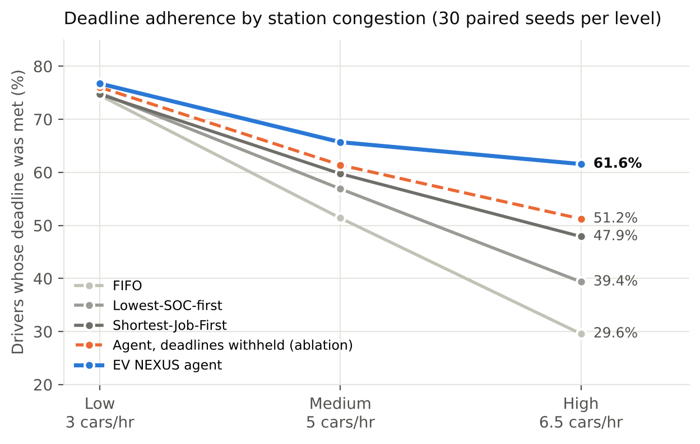
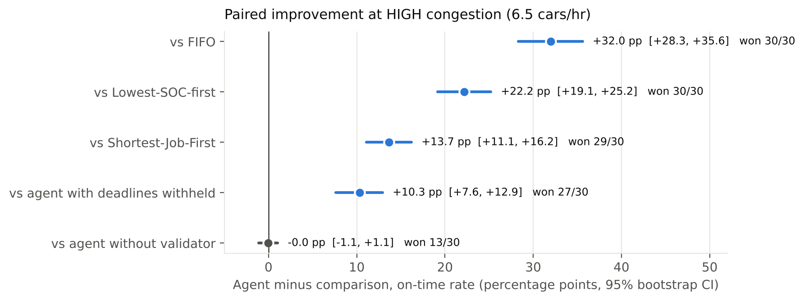
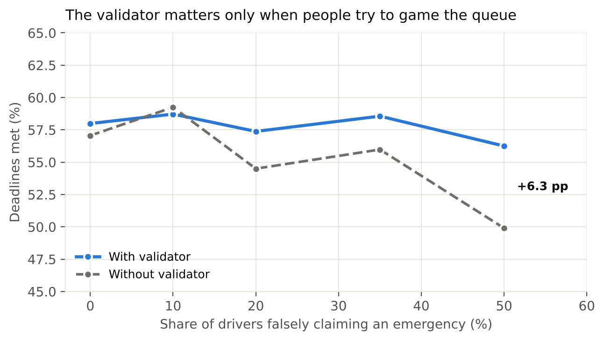

# EV NEXUS: Language-Aware Scheduling for EV Charging Stations

**Project report** · Karthik ([@Karthik705](https://github.com/Karthik705)) · October 2026  
Code: [github.com/Karthik705/ev-nexus](https://github.com/Karthik705/ev-nexus) · Live demo: [ev-nexus.pages.dev](https://ev-nexus.pages.dev)  
PDF version: [PROJECT_REPORT.pdf](PROJECT_REPORT.pdf)

---

## Abstract

EV charging stations schedule cars using telemetry: arrival time, state of charge (SOC),
battery size. But the constraint that matters most to a driver, *when they have to
leave*, is usually not in the telemetry at all. It is in what the driver says: "my
flight leaves in 2 hours and the airport is 40 minutes away" is an 80-minute deadline.

EV NEXUS is a charging-station scheduler that recovers that constraint from natural
language with an LLM (Google Gemini), checks every claim against telemetry with a
deterministic validator so drivers cannot talk their way to the front of the queue, and
dispatches cars with a deadline-aware greedy matching algorithm. In a paired benchmark
of 30 seeds per congestion level, it meets **61.6%** of driver deadlines at high
congestion against **29.6%** for first-in-first-out and **47.9%** for the strongest
conventional baseline (Shortest-Job-First). That is +13.7 to +32.0 percentage points,
with every 95% confidence interval excluding zero. It does this while serving more cars
and using less port time. An ablation that withholds only the language-derived deadline
drops the agent to 51.2%, which shows the gain comes from the information in language
and not from a better-tuned scoring function.

The system ships as a FastAPI backend and a React/TypeScript dashboard, deployed at no
cost on Render and Cloudflare Pages, and is covered by 40 Python tests and 9 Playwright
browser tests.

---

## 1. Problem

A public charging station has a few ports of different power (7 kW, 50 kW, 150 kW) and,
at busy times, more cars than ports. Something has to decide who charges next and on
which port. The standard options are:

| Policy | Rule | What it optimises |
|---|---|---|
| First-in-first-out (FIFO) | Arrival order | Perceived fairness |
| Shortest-Job-First (SJF) | Least energy needed first | Throughput, average wait |
| Lowest-SOC-first | Emptiest battery first | Avoiding stranded drivers |

All three see only telemetry. None of them can tell the difference between a driver who
is rushing to the airport and one who is parked for a three-hour lunch, because that
difference is never transmitted by the car. It is only ever *said*.

Two requirements follow:

1. **Use the language.** Extract the deadline and urgency hidden in a driver's free-text
   request, and schedule against it.
2. **Do not trust the language blindly.** If "this is an emergency" moves you to the
   front of the queue, everyone will say it. Any claim that contradicts physical
   telemetry has to be caught by something that is not an LLM.

The project's success criterion was chosen to match the first requirement exactly:
**deadline adherence**, the share of drivers who received the energy they needed before
they had to leave. It is the one metric where a language-aware scheduler has a
structural advantage rather than a tuning advantage.

## 2. System design


### 2.1 Pipeline

```
Driver message ──► Gemini (structured intent extraction)    llm_negotiator.py
                         │  urgency, deadline_minutes, reason, confidence (strict JSON)
                         ▼
                   Deterministic validator                  constraint_validator.py
                         │  SOC / battery / budget always from telemetry, never from the LLM
                         │  "lie detector": urgency claims that contradict SOC are downgraded
                         ▼
                   Deadline-aware scheduler                 schedule_engine.py
                         │  greedy maximum-weight (car, port) matching, every minute
                         ▼
                   Port assignment + live dashboard          app.py  ·  frontend/
```

The design rule is that **the LLM interprets and never decides**. Gemini's only job is to
turn a sentence into a small structured record. Every decision that affects who charges,
where, and at what price is made by deterministic code.

### 2.2 Intent extraction

`llm_negotiator.py` sends the raw driver message to Gemini at temperature 0 and asks for
strict JSON: `urgency_level`, `deadline_minutes`, `reason_category`,
`claimed_constraints`, `requested_port_type`, `confidence`, `explanation`. Failures are
classified (`AUTH_ERROR`, `RATE_LIMIT`, `PARSE_ERROR`, `TIMEOUT`, …) and logged, never
swallowed. If Gemini is unavailable, rate-limited or returns malformed JSON, the system
falls back to telemetry-only priority. The fallback is tested and can be forced live
from the dashboard.

### 2.3 Validation: the "lie detector"

`constraint_validator.py` is the single place where LLM output meets physical state:

- SOC, battery capacity, maximum charge rate and budget are read **only** from telemetry.
  The LLM's output has no field that can set them.
- If the claimed urgency is high (score above 0.5) **and** the battery is more than 60%
  full, the claim is downgraded to low urgency and flagged as a contradiction. A driver at
  85% SOC who says "emergency, I need the 150 kW port now" is not obeyed.
- Port feasibility is computed from actual port occupancy and the car's real maximum
  charge rate.

Boundary tests check the rule at exactly 60% and 61% SOC.

### 2.4 Scheduling algorithm

Every simulated minute, the agent scores every feasible (car, port) pair and greedily
commits the highest-scoring non-conflicting pairs, a greedy maximum-weight matching.
The score has five terms, in priority order:

1. **Deadline feasibility (dominant).** A large bonus if finishing on this port lands
   before the driver's deadline. Saving a deadline outranks everything else.
2. **Least slack first.** Among assignments that work, commit the tightest one first. A
   driver with four hours of slack loses nothing by waiting ten minutes.
3. **Validated urgency.** The telemetry-checked value, never the raw claim.
4. **Power matching.** Reward delivered power and penalise parking a 7 kW car on a
   150 kW port. This term keeps throughput competitive.
5. **Aging.** Waiting time accumulates priority, so nobody starves.

When a message contains no number ("my wife is in labor"), Gemini returns no deadline;
the agent then infers one from validated urgency (CRITICAL → 15 minutes) instead of
treating the driver as having unlimited slack.

Greedy matching was chosen over optimal (Hungarian) assignment deliberately: with five to
eight ports the quality difference is small, and every decision stays explainable to the
driver, which the dashboard shows for each car.


### 2.5 Technology

| Layer | Technology |
|---|---|
| Backend | Python 3.11, FastAPI, Pydantic, Uvicorn |
| LLM | Google Gemini (`google-genai`), temperature 0, strict JSON |
| Simulation / RL | NumPy, PyTorch, Gymnasium (DQN experiment) |
| Frontend | React 19, TypeScript, Vite, React Router, Recharts, custom SVG Gantt chart |
| Testing | pytest (40 tests), Playwright (9 browser tests) |
| Deployment | Render (API) and Cloudflare Pages (UI), free tier |

## 3. Evaluation method

A scheduling result is only as good as the comparison behind it. An earlier version of
this project's benchmark (Phase 5) was audited and found to be unsound in three ways:
the budget rule was enforced only for the LLM policies, arrival streams silently diverged
between policies despite a shared seed, and deadline adherence was never measured. The
current benchmark (`benchmark_v2.py`) was rebuilt to remove each defect.

### 3.1 Identical world for every policy

Every policy shares, bit for bit: charging physics (power limits, taper above 80% SOC),
pricing (energy × port tier, with **no** urgency multiplier, so knowing urgency cannot
inflate revenue), budget enforcement, each car's energy requirement, and the arrival
stream. All conventional baselines get the same best-fit port heuristic, so they are
competitive rather than strawmen; only the queue ordering differs. Each of these
guarantees is a test in `tests/test_schedule_engine.py`.

### 3.2 Ground truth that cannot leak

`scenario_library.py` holds 20 canonical driver messages. For each, the deadline and
urgency a careful human reader would infer were written down **by hand, from the text**,
with the reasoning recorded alongside. These labels are:

- **independent of Gemini's output**, so extraction quality can be measured rather than
  assumed. Gemini recovered **8 of 12** ground-truth deadlines (66.7% recall) and agreed
  on urgency in 19 of 19 judged cases. The four misses are messages with no number in
  them ("leave immediately", "ASAP");
- **used only for grading.** A test shifts every ground-truth deadline by +997 minutes
  and asserts that every agent decision is byte-identical. If the answer key ever leaked
  into a decision, that test would fail.

The agent therefore works from imperfect extraction, exactly as a deployed system would.

### 3.3 Paired statistics

One arrival stream is generated per seed and replayed verbatim to every policy (common
random numbers), so each seed is a genuine paired observation. There are 30 seeds per
congestion level, each a 24-hour simulated day on a five-port station
(7 / 50 / 50 / 150 / 150 kW), at 3, 5 and 6.5 arrivals per hour. Confidence intervals
are paired percentile bootstrap with 10,000 resamples. The benchmark replays captured
Gemini responses (`llm_fixtures.json`) so that API latency and quota cannot contaminate a
scheduling comparison; it runs with no API key and no network.

### 3.4 Controls

Two ablations are the scientific controls:

- **Agent, deadlines withheld.** The identical scheduler, same weights and matching, with
  only the language-derived deadline removed. If the agent's advantage came from tuning
  rather than language, this variant would keep it.
- **Agent, no validator.** Urgency claims are trusted outright. This measures what the
  validator is worth.

## 4. Results

### 4.1 Deadline adherence



| Policy | Low (3/hr) | Medium (5/hr) | High (6.5/hr) |
|---|---|---|---|
| FIFO | 74.5% | 51.4% | 29.6% |
| Lowest-SOC-first | 75.0% | 56.9% | 39.4% |
| Shortest-Job-First | 74.7% | 59.7% | 47.9% |
| **EV NEXUS agent** | **76.7%** | **65.7%** | **61.6%** |
| Agent, deadlines withheld | 76.0% | 61.4% | 51.2% |

The advantage over the best conventional baseline grows with congestion: +1.8 pp at low
load, +5.9 pp at medium and +13.7 pp at high. This is the expected shape. With spare
capacity everyone is served promptly and scheduling barely matters. Knowing who is
actually in a hurry only pays once cars compete for ports. The small low-load gain is
reported rather than hidden.

### 4.2 Paired comparison at high congestion



| Agent vs | Δ deadlines met | 95% CI | Seeds won |
|---|---|---|---|
| FIFO | +32.0 pp | [+28.3, +35.6] | 30 / 30 |
| Lowest-SOC-first | +22.2 pp | [+19.1, +25.2] | 30 / 30 |
| Shortest-Job-First | +13.7 pp | [+11.1, +16.2] | 29 / 30 |
| Same agent, deadlines withheld | +10.3 pp | [+7.6, +12.9] | 27 / 30 |

The deadline-withheld ablation is the result the project's claim rests on. Removing
only the information extracted from language costs 10.3 points and pushes the agent back
toward the conventional policies. The gain is the information, not the scoring function.

### 4.3 No trade-off against throughput

At high congestion:

| Policy | Cars served | Avg wait | p95 wait | Port time used | Urgent drivers on time |
|---|---|---|---|---|---|
| FIFO | 96.8% | 164 min | 407 min | 82.4% | 17.6% |
| Lowest-SOC-first | 97.3% | 148 min | 763 min | 83.7% | 33.2% |
| Shortest-Job-First | 97.8% | 83 min | 493 min | 82.5% | 38.1% |
| **EV NEXUS agent** | **98.5%** | **53 min** | **226 min** | **76.0%** | **48.6%** |

The agent serves more cars, with shorter average and tail waits, while occupying ports
for less time. Deadline adherence is not bought with throughput: the power-matching and
slack terms put fast-charging cars on fast ports and keep short jobs moving.

### 4.4 What the validator is worth



| Drivers falsely claiming urgency | With validator | Without | Paired Δ | Significant |
|---|---|---|---|---|
| 0% | 58.0% | 57.1% | +0.9 pp | no |
| 10% | 58.7% | 59.3% | −0.5 pp | no |
| 20% | 57.4% | 54.5% | +2.9 pp | yes |
| 35% | 58.6% | 56.0% | +2.6 pp | no |
| 50% | 56.2% | 49.9% | +6.3 pp | yes |

When nobody games the system, the validator changes nothing, which is correct for an
integrity mechanism. Its value appears under adversarial pressure: at 50% gaming it
protects 6.3 points of deadline adherence. It is an anti-gaming property, not a
throughput optimisation, and the report claims no more than that.

### 4.5 Negative result: reinforcement learning

A Deep Q-Network (PyTorch, Gymnasium environment with a 42-dimensional state and 26
actions) was trained as an alternative dispatcher. It learned to *defer* dispatching to
avoid negative rewards (reward hacking / value hoarding) and scored lowest of all
policies in every scenario (satisfaction 0.09–0.13 against 0.31–0.61 for heuristics).
It is kept in the repository as a documented experimental baseline with full checkpoint
provenance (`docs/DQN_PROVENANCE.md`), and is not part of the deployed system. The
lesson: for a problem with a clear, explainable objective, a well-designed deterministic
policy beat a learned one, and was far easier to verify.

## 5. Engineering and verification

**Testing.** 40 Python tests cover the validator, the scheduler and fairness invariants:
identical budget rules, no urgency pricing, no deadline belief in conventional policies,
no port double-booking, an unmodified arrival stream, causal independence of ground
truth, and imperfect extraction (a guard against substituting an oracle). A further set
of tests parses the numbers published in the README and the experiments document and
checks them against the benchmark output, so the documentation cannot drift from the
data. Nine Playwright tests drive the production bundle in a real browser, including a
check that no API key appears in any served script.

**Defects found and fixed during the project.** The benchmark audit (Section 3) was the
largest. Others: the charge target was a hard-coded 80 kWh rather than 80% of capacity,
so small batteries displayed SOC above 100%; an over-budget request was silently dropped
but reported to the UI as "waiting" (it is now an explicit `REJECTED_BUDGET`); a port
could be double-booked through an off-by-one in completion timing (caught by a test); and,
found by sweeping congestion levels rather than by any test, the power term scored a
50 kW car on the 7 kW port as perfectly efficient (7/7 = 1.0), so the agent parked fast
cars on slow ports and was *worse* than every baseline at low load. It now rewards
achieved power and penalises over-provisioning separately.

**Deployment.** The API runs on Render and the dashboard on Cloudflare Pages, both on free
tiers. CORS is locked to the exact frontend origin, the Gemini key exists only on the
server, and each browser session gets isolated simulation state. The dashboard's pages
are code-split so the charting library loads only when needed.


## 6. Limitations

- **Simulated world.** Arrival times, battery sizes and charge rates are drawn from
  plausible distributions, not real station logs, and the charging physics is simplified.
  The *comparison* between policies is sound because every policy faces the identical
  world; the absolute percentages are not a claim about any real station.
- **Fixed message set.** Results depend on 20 driver messages. A station whose customers
  never state deadlines would see no benefit, which is what the low-congestion and
  deadline-withheld rows show.
- **Judgement in labels.** "Leave immediately" is labelled as 10 minutes; another reader
  might choose 5 or 15. Every label's reasoning is recorded so it can be challenged.
- **Live LLM path.** The benchmark replays captured Gemini responses. The live call path
  is exercised in the demo and degrades to telemetry-only scheduling when the model is
  unavailable; it is not part of automated testing.
- **Demo-grade state.** Sessions live in process memory with no persistence or expiry,
  which is fine for a demo and not for production.

## 7. Future work

- Replace simulated arrivals with a public charging-session dataset to test the result
  on real demand patterns.
- Persist sessions in Redis or a database with expiry for multi-instance deployment.
- Return per-constraint pass/fail detail (budget, charge rate, port compatibility) from
  the negotiation API so every validation step is visible to the driver.
- Compare greedy matching against optimal assignment at larger station sizes.
- Let the driver confirm or correct the extracted deadline before scheduling, closing the
  gap left by messages with no explicit number.

## 8. Conclusion

The project set out to test one idea: that the most important scheduling constraint at a
charging station is often spoken rather than measured, and that an LLM can recover it
safely if a deterministic layer stays in charge of every decision. Under a benchmark
built to be fair, with paired seeds, hand-labelled ground truth kept out of the decision
path and an ablation that isolates the effect of language, the language-aware scheduler
met 61.6% of deadlines at high congestion against 29.6–47.9% for conventional policies,
served more cars and used less port time. Withholding the language-derived deadline
removes most of the gain, which is the evidence that the improvement comes from what
drivers say.

---

### Reproducing every number in this report

```bash
pip install -r requirements.txt
python benchmark_v2.py              # 30 paired seeds x 3 congestion levels
python scenario_library.py          # extraction quality vs ground truth
python docs/report/make_figures.py  # the three figures above
python docs/report/build_pdf.py     # this report as PDF
pytest                              # 40 tests, incl. checks on published numbers
```

No API key or network access is needed. Detailed methodology:
[EXPERIMENTS.md](EXPERIMENTS.md) · Architecture: [ARCHITECTURE.md](ARCHITECTURE.md) ·
Test report: [TEST_REPORT.md](TEST_REPORT.md)
